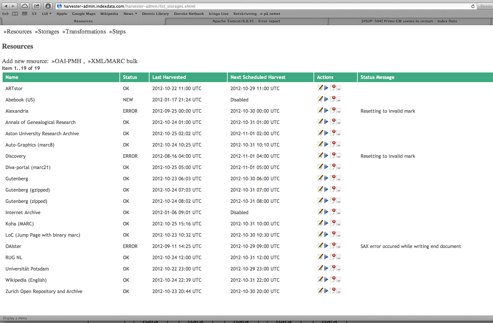

# Harvest Jobs #

When you access the Harvester Admin web site (URL and login credentials, or
lack of therof, is deployment specific) you will be welcomed by the Harvest
Job page.

On the Harvest Job page, you will see a list of currently harvested resources and their status, and you can perform actions like Edit, Run, Delete and View the latest job log.



From here you can manage existing resources or add new ones.

## Add new Resource ##

The Harvester currently supports harvesting OAI-PMH resources and XML/MARC binary bulk data.

Click the OAI-PMH or XML/Marc Bulk to add a new Resource to harvest.

### General Job Settings ###

Setting up a new Harvesting job consists of entering some general harvesting information plus specific settings for this type (OAI-PMH or XML/Marc Bulk). 

The screen capture below shows the general settings:

* Name: Preferably a unique name for users to identify this Harvester resource.

* Content Description and Technical and Contact Notes (not used by the Harvester, but for ease of support staff). 
Harvest schedule: A recurring time at which the Harvester job should run. 

Checkboxes for:

* Harvest now: Run the harvesting job right after Add/Save.

* Harvest job enabled: The harvesting job will only be scheduled if checked.

* Overwrite: Delete all data before the run. Since OAI-PMH supports increment updates, this is not generally used with OAI-PMH jobs. If used with OAI-PMH, it is necessary to clear "Harvest From" and Resumption Token,otherwise it will only be a partial data set.

* Transformation Pipeline: In order to get the data stored, we need to transform the data from whatever input format the feed is delivering, into an internal format used by the Harvester.

* Storage: Select which storage the harvested data should use. The Harvester supports multiple backend storages. This could be for staging like Development, Testing and Production, or it could be for different customers.

### Resource-specific Settings ###

Depending on which resource type you choose, the following settings will apply.

#### OAI-PMH Specific Information: ####

* OAI Repository URL: a link (http-based) to the resource to harvest. The base link defined by OAI Set Name: some resources have multiple sets within the repository. If none is selected, the full repository will be harvested.

* Metadata Prefix: A repository uses one of two prefixes (or data embedding format): Dublin Core or MARC XML embedded data. It is important to choose the right one otherwise no data will be harvested. Also, the Transformation selected should match this format otherwise no record will be found. 

* Use long data format: Check box to indicate whether to use a long data format when asking for records from the OAI-PMH resource. This is not used very often, but should match what the resource requires.

* Harvest from date: If empty and no resumption token is set, the Harvester will harvest the full data set from the resource. On completion the Harvester will set the date to yesterday, so next run will only harvest the newer records received since last run.

* Resumption token: The OAI-PMH protocol supports chunking bigger datasets into smaller chunks. On delivery of a chunk the OAI-PMH returns a token which the next request should use in order to get the next chunk. If an OAI-PMH job halts before completion the resumption token will be set in this field. Sometimes it is possible to run it again from this resumption point at a later stage, but this is not always supported.


#### XML Bulk Specific Information: ####

The XML/MARC specific settings look like this:

* URLs: One or more space-separated URL to XML or MARC binary data. Jump or index pages (e.g. html pages with URLs) are supported as well.

* Split at depth: For XML data. This should usually be set to 1 for XML feeds, if we want to harvest the record elements in the data structured like:

```
    <root>
     <record/>
     <record/>
     …
    </root>
```

* Split (number of records): The Harvester tries to imply streaming parsing where possible, but some (rather most) XSL Transformations will not support this. Attempting to transform millions of records will be too memory consuming. Breaking into chunks of 1000 seems to be a reasonable option.

* MIME-type for compressed data: The Harvester detects the type (XML vs MARC binary) from the MIME-type. A correctly configured web site will send a MIME-type of Application/marc if the file type is .mrc. If the MIME-type received is different than expected (because of a wrongly configured web site or wrong file type), the MIME-type might need to be overridden. The format of the field is:
```
    MIME-type [; optional character encoding]. 
```
The Harvester  supports gzipped data (and partly supports zipped data: only the first entry will be extracted), but the Harvester then needs to be configured of the format the compressed data contains (XML or MARC).

* Output format: This express the output format of binary MARC reading which will be the input for the transformation pipeline. If the Transformation Pipeline expects MARC21 XML, this should be set to Application/marc. If the pipeline expects Turbo MARC XML, it should be set to Application/tmarc.
