\newpage

# Using Harvester Admin #

## Harvest Jobs ##

The Harvester Admin web site (URL and login credentials are deployment specific) opens to the Harvest
Jobs page.

The navigation menu at the top of the Harvest Jobs page allows one to switch between sections of the Harvester Admin, such as "Storage Engines", "Transformaton Pipelines", "Transformation Steps" and "Settings". 

The Harvest Jobs page displays a list of currently harvested resources along with: corresponding job status (NEW/OK, RUNNING, ERROR, WARN), date of the last harvest, number of records harvested during the last harvest, date for the next harvest and most recent status message. Using the icons in the "Actions" column, one can Edit (the job settings), Run the job (a play/stop toggle icon), View the most recent job log, or Delete the job.

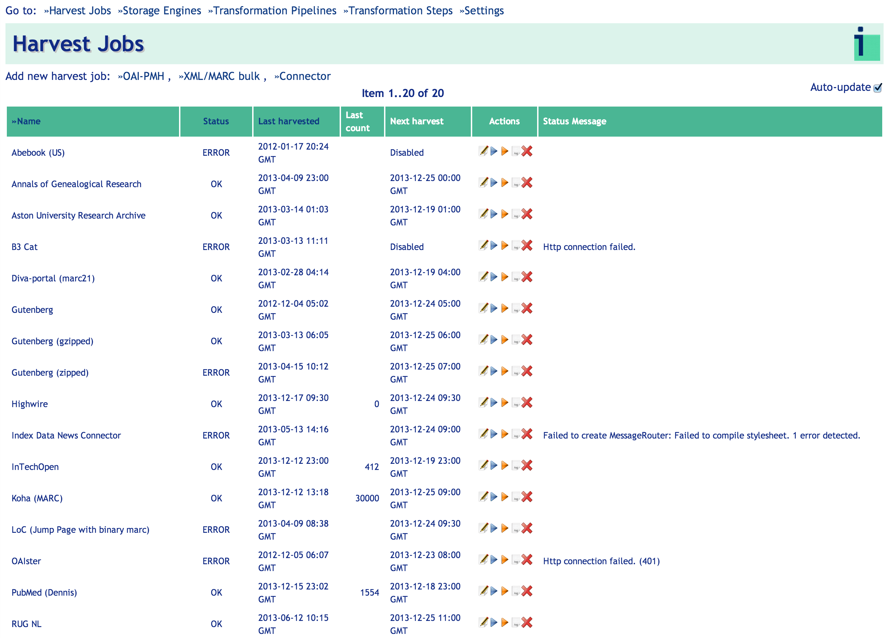

By default, the job list view is refreshed automatically to enable monitoring job status without having to refresh the page. Turn off this behavior by unchecking the _Auto-Update_ check-box in the top-right corner.

Links for adding new harvest jobs appear just below the navigation menu.

### Editing or adding new Harvest Jobs ###

The Harvester currently supports harvesting OAI-PMH resources, XML, SGML, CSV and MARC binary data (FTP or HTTP), and data obtained through Index Data screen-scraping solution called Connector Platform. 

Click one of those three selections to add a new Resource to harvest, and follow the instructions below. 

#### General Job Settings \

Setting up a new Harvesting job consists of entering general harvesting information as well as settings specific to the type of job (OAI-PMH, XML/Marc Bulk or Connector-based). 

The screen capture below shows the general settings applicable to all three types of Harvesting jobs:

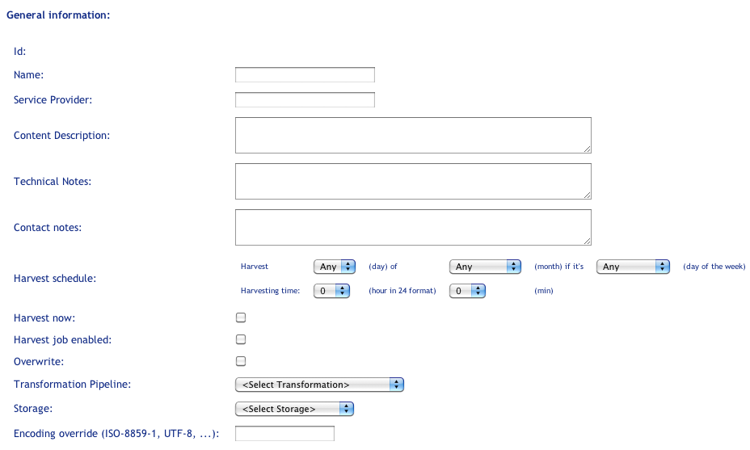

* _ID_: Automatically assigned identifier for the job.

* _Name_: Preferably a unique name for users to identify this Harvester resource. In some cases the name may be proposed after filling out protocol specific
section of the configuration (e.g Index Data Connectors, OAI-PMH).

* _Service Provider_,  _Content Description_,  _Technical Notes_ and _Contact Notes_: These free-text fields are not used by the Harvester, but by support staff for recording useful administrative information.

* _Harvest job enabled_: Check to run the Harvesting job as described by the time/interval selected in "Harvest schedule". Leaving this box unchecked will make the job inactive.

* _Harvest schedule_: Use these fields to define a recurring time/interval at which the Harvester job should run. E.g for weekly runs specify a day of the week
on which the harvest should be executed.

<!-- 
    D: CAN WE REALLY ONLY SCHEDULE MONTHLY OR DAILY HARVESTS? THESE FIELDS CERTAINLY SUGGEST THAT, BUT I CAN SEE CUSTOMERS WANTING WEEKLY, BIWEEKLY, BIMONTHLY, ETC.
    Jakub: internally we can support any schedule that Cron supports:
    * weekly -- select any day of the week, eg Monday
    the others you mention cannot be directly represented with  drop-downs:
    (bimonthly could be hacked by choosing 31st, close)
    What we could do is to let users specify multiple schedules, which
    the harvester will evaluate in order:
    e.g:
    * biweekly ~ 2 times a month, e.g on the 14th and 28th of any month
    * bimonthly ~ list the exact month numbers: 1,3,5,7,9,11
    This is new development though.
-->

Remaing settings include:


* _Transformation Pipeline_: Select the transformation required to match the input format delivered by the feed to the internal format used by the Harvester for data storage. See the _Transformation Pipelines_ manual section for more details. 
<!---
    D: THIS SECTION NEEDS MORE INFORMATION ON THE TRANSFORMATION CHOICES THEMSELVES.
    Jakub: maybe a link to the transformation section?
    D: I don't see that helping much, unless I'm missing something.
    Jakub: I mean there's a whole chapter on TPs in the manual, instead of putting more text here let's refer user to that section.
-->

* _Use lax parsing_: when enabled, harvester will attempt to parse malformed XML (missing closing tags, entities) or mark-up that is not strict XML, like HTML or SGML. Especially, when dealing with HTML or SGML documents, and this setting is disabled, the harvester will not even attempt to read those documents.  

* _Encoding override_: A feed can return invalid encoded responses, such as having an XML header with encoding set to UTF-8, but actually return ISO-8859-1 in the data. Setting this field to the actual encoding will force the Harvester to use the specified encoding. 

* _Storage_: Select the storage type and location for the harvested data. The Harvester has a storage abstraction layer to allow it to work with multiple potential record storage systems, but at present, only Solr/Lucene is supported. Once the _Storage_ has been selected, it is possible to view the indexed records by clicking the _Stored records: click to view_ field.

* _Cache on disk_: if enabled, harvest data is kept in the filesystem cache and the job can be restarted from this cache without needing to go back to the server.

* _Limit record number to_: limit the harvest run to a specified number of records: useful for testing job settings and transformation pipelines.

* _Connection/read timeout_: specify a non-default timeout value for obtaining and reading from the network connection (socket). Values under 1 minute are not recommended.

* _Log level_: specify the logging level for the job with DEBUG being the most verbose. INFO is the recommended log level in most cases.

* _Notification e-mail address(es)_: specify comma separated list of e-mail addresses that should receive notification on job completion.

* _Send notification if severity at least:_: specify job completion status with the least severity that will trigger the e-mail notification

* _List of constant fields_: a comma-separated list of NAME=VALUE pairs. For a harvestable that has this field set, each harvested record has each NAME field set to the corresponding VALUE.

* _Extra configuration (JSON)_: specify additional advanced harvester configuration in the JSON format.

Buttons:

* _Reset cache_: this button will clear the filesystem cache for this job

* _Reset_: this button will reset a job back to the initial (newly created) state, which means resetting any status fields and date fields. This will also delete any records in the associated storage. 

* _Delete Job and Records_: this button will completely remove both the job and the harvested records in the associated storage.


#### Resource-specific Settings \

Depending on which resource type you choose, the following settings will apply.

##### OAI-PMH Specific Information: \


This job type uses the Open Archive Initiative's Protocol for Metadata Harvesting to harvest data from conforming repositories. This is the most feature rich option with support for incremental and selective harvesting. When the repository
URL is provided, the harvester will detect the repository capabilities and
settings and fill them out automatically.
 
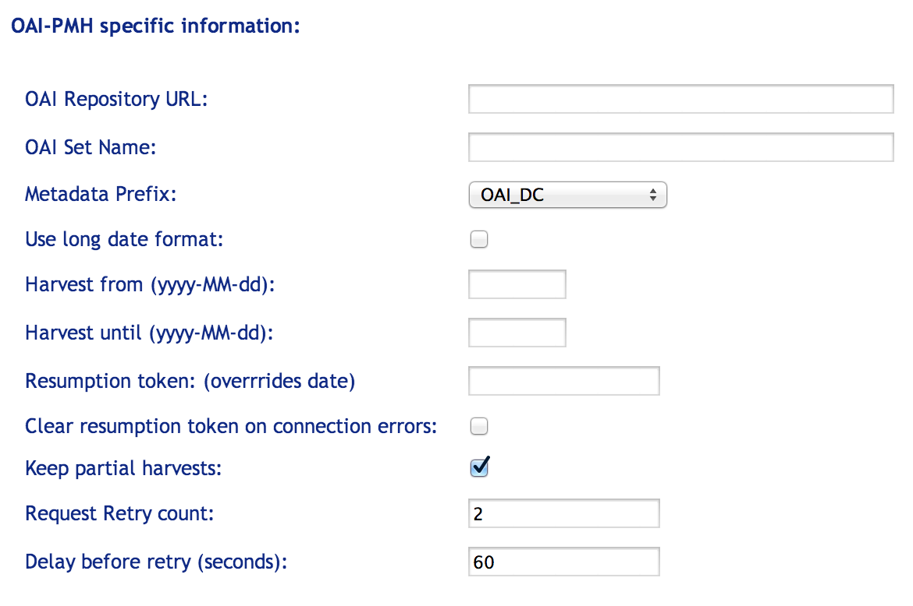

* _OAI Repository URL_: Enter a link (http-based) to the resource to be harvested. Include the base link defined by OAI Set Name: (see below). Some resources have multiple sets within the repository. If no specific set is identified by the URL, the full repository will be harvested.

* _OAI Set Name_: an optional setting, an OAI-PMH _setSpec_ value which specifies set criteria for selective harvesting.

* _Metadata Prefix_: A string that specifies the metadata format in OAI-PMH requests issued to a targeted repository. It is important to choose the correct format or no data will be harvested from the repository. Make sure a Transformation Pipeline that matches the metadata format used in the repository is selected, otherwise records will not be understood by the Harvester. Repositories generally use one of the following prefixes (or embedded data formats): Dublin Core (OAI-DC) or MARC XML (MARC12/USMARC). Other less common MetadataPrefix values include PMC (PubMed Central full-text records), PMC (PubMed Central metadata records), and PZ2 (pazpar2).

* _Use long date format_: Check-box to indicate whether to use a long date format when requesting records from the OAI-PMH resource. This is not used very often, but is required by some resources.

* _Harvest from (yyyy-MM-dd)_: If empty and no resumption token is set, the Harvester will harvest the full data set from the resource. When this field contains a value, upon completion of the job the Harvester will reset the value of this field to the day prior to the current run date, so subsequent runs will harvest only new records.

* _Harvest until (yyyy-MM-dd)_: upper date limit for selective harvesting. On consecutive runs the Harvester will clear this field making the date interval open-ended.

* _Resumption token_: The OAI-PMH protocol supports splitting bigger datasets into smaller chunks. On delivery of a chunk of records, the OAI-PMH returns a token which the next request should use in order to get the next chunk. If an OAI-PMH job halts before completion, the resumption token will be set in this field. Sometimes it is possible to run it again from this resumption point at a later stage, but this is not always supported.

* _Clear resumption token on errors_: clear the resumption token for harvests that complete in an error state. This is useful when server errors out and the last resumption token is no longer valid.

* _Keep partial harvests_: when checked, partial records harvested during a failed harvest run will be retained in storage.

* _Request retry count_: specify how many times the harvester should retry failed harvest requests, 0 disables retrying entirely..

* _Delay before retry_: delay for retrying failed requests. Only change when resource fails to work with the default values.

##### XML/MARC Bulk Specific Information: \

The XML/MARC Bulk job type allows harvesting XML or binary MARC files using
standard Internet protocols (HTTP and FTP). 

The XML/MARC specific settings look like this:

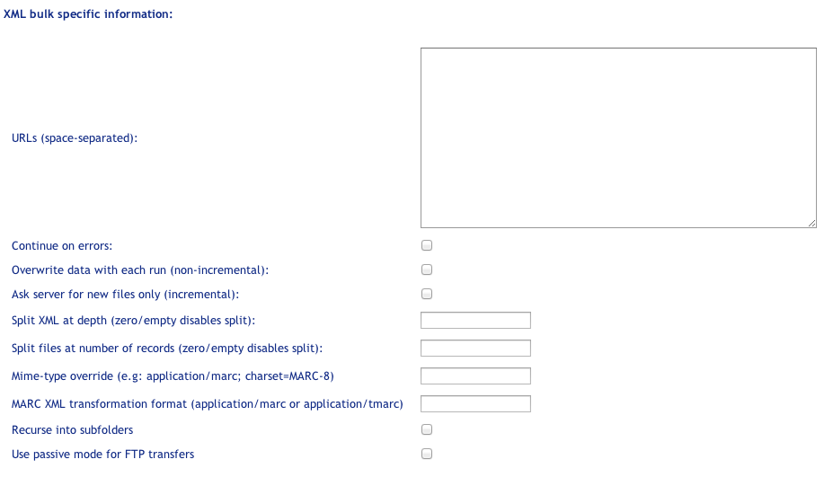

* _URLs_: One or more space-separated URL (HTTP or FTP) for XML or MARC binary data. Jump or index pages (HTML pages with URLs) are supported and so are FTP directories. For FTP, harvesting of recursive directories may be enabled below.

* _Continue on errors_: Check to continue harvesting and storing records even if retrieving some of the listed resources fails.

* _Overwrite data with each run_: Check to delete all previously harvested data before beginning the next scheduled (or manually triggered) run. This may be used when complete catalog dumps reside on the server.

* _Ask server for new files only_: ask the server if the files are modified before attempting a harvest, relies on proper timestamp handling on the server side. It's usually safe to have this enabled as servers are eager to update the modification date, even in cases when the files themselves don't change. Enabling this setting may significantly shorten harvest times.

* _Initial from date_: allows to specify the initial _from_ harvest date when _ask server for new files only_ option is checked. When filled out, files older than the specified value will be only harvested. 

* _Split XML at depth_: For XML data. This should usually be set to 1 for XML feeds, if we want to harvest the record elements in the data structured like:

```
    <root>
     <record/>
     <record/>
     
    </root>
```
* _Split at number of records_: The Harvester tries to imply streaming parsing where possible, but many XSL Transformations will not support this. Attempting to transform millions of records will be too memory consuming, so breaking the resource into chunks of 1000 records seems to be a reasonable option. Enter into this field the number of records to be contained in each chunk. 

* _MIME-type override_: The Harvester detects the type (XML, binary MARC, CSV) from the MIME-type file contents and extension. It is also able to deal with compressed archives (zip, tar, gzip), in some rare case it may be required to provide the content type manually (e.g if it's missing or it's wrong), the format is:
```
    MIME-type [; optional character encoding].
```

* _MARC XML transformation format_: This field expresses the output format of binary MARC reading--which will also be the input format for the transformation pipeline. If the Transformation Pipeline expects MARC21 XML, this should be set to Application/marc. If the pipeline expects Turbo MARC XML, it should be set to Application/tmarc.


* _Recurse into subfolders_: When set, the harvester will traverse the entire directory tree and search for harvestable files. This setting should be enabled with care.


* _Use passive mode for FTP transfers_: When set passive, instead of active, mode is used for FTP connections. If harvester is running within a restricted firewall that blocks FTP active mode connections, enabling this setting might help. It might be, however, necessary to align this mode with what FTP server expects.

* _CSV parser configuration_: the harvester will detect (either by MIME-type or by file extension) and attempt to parse CSV (comma separated values) files into an XML representation for further processing. The XML representation of each data row looks as follows:


```
<row>
  <field name="column name or number">field value</field>
  ...
</row>
```

Unless the _split at depth_ option is set to > 0, all rows will be parsed into a single XML document and wrapped with an additional `<rows>` root element. For large CSV files it may be a good idea to set the _split at depth_ to 1.

The parser configuration is expressed in a semicolon delimited key/value list, like so: `key1=value1; key2=value2`. List of supported options is as follows:

* `charset`: default `"iso-8859-1"`, specifies the character encoding of the files

* `delimiter`: default `","` for CSV and `"\t"` for TSV, specifies the field delimiter used in the files

* `containsHeader`: default `"yes"`, specifies if the first line in the files contains the header line

* `headerLine`: no default, allows to override or specify headers, format is a comma-separated list  e.g `headers="title,author,description"`


##### Connector Specific Information: \

The Connector Harvest Job uses MasterKey Connect technology to harvest and extract information from any web site or data source that does not support standard harvesting protocols such as OAI-PMH. In order to set up Harvesting Connector jobs, one must have access to the _harvesting connector_ prepared for the MKC platform. Please see MKC pages on the IndexData website for more information. Specific settings look like this:

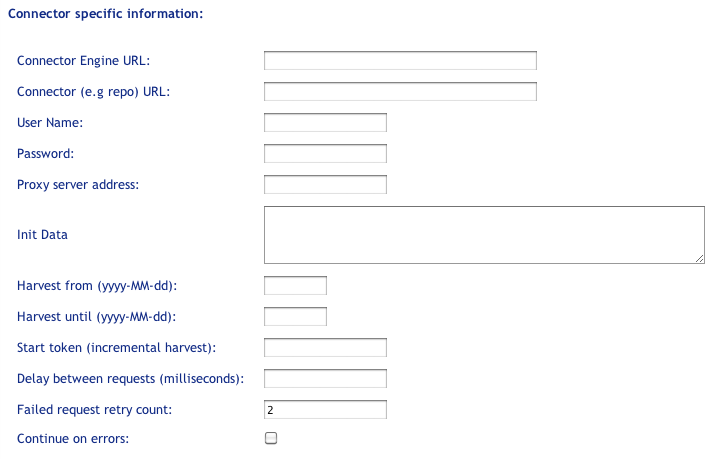

* _Connector Engine_: select the Connector Engine instance that will be used to execute the Connector harvesting job. The default engine is hosted by Index Data but may be also installed locally on the customer site. Additional Connector Engines can be specified through the _Settings_ tab.

* _Connector Engine Parameters_: additional or custom values of Connector Engine session parameters used by this job. See [CFWS manpage](http://www.indexdata.com/connector-platform/enginedoc/cf_webservice.html) for more information. 

* _Connector Repository_: select the connector repository where the Connectors are hosted and maintained. Usually, the Connector Repository is provided by Index Data and may require a login account. The account credentials are provided directly in the Connector Repository URL setting accessed from the _Settings_ tab and should have the form: `http(s)://<repouser>:<repopass>@url.to.the.repository`. 
* _Connector_: Enter here the name of the harvesting connector specific to the harvested resource. This field provides suggestions by looking up the Repository so only a couple of initial characters or a part of the name is required.

* _Overwrite with each run_: Check to delete all previously harvested data before beginning the next scheduled (or manually triggered) run.

* _User Name_: User name required for access to a harvested resource that requires authentication.

* _Password_: Password required for access to a harvested resource that requires authentication.

* _Proxy server address_: address of the proxy server that should be used by
the harvesting engine, e.g to deal with cases when the resource is IP authenticated.

* _Init Data_: Advanced setting to provide additional initialization parameters to the harvesting connector. Any username/password/proxy specified in the inputs above will take precedence over settings specified in this field. These settings must be provided in JSON format.

* _Harvest from_: Start date for selective harvesting; this functionality depends on the connector capability.

* _Harvest until_: End date for selective harvesting; this functionality depends on the connector capability.

* _Start token_: The use of a start token for incremental harvesting is connector specific and depends on the connector capability. This setting must be provided in JSON format.

* _Delay between requests_: delay between requests made from the harvester to the connector engine. Use when the resource is sensitive to high loads.

* _Failed request retry count_: specify how many times the harvester should retry failed harvest requests, 0 disables retrying entirely..

* _Continue on errors_: if checked the harvester will ignore failed harvest
requests (subject to retry count) and continue until link tokens are exhausted. This may lead to partial harvests.

## Storage Engines ##

Selecting the _Storage Engines_ menu item shows the list of currently configured storage formats and locations. From this screen one can add, edit or delete a storage specification for harvested records.

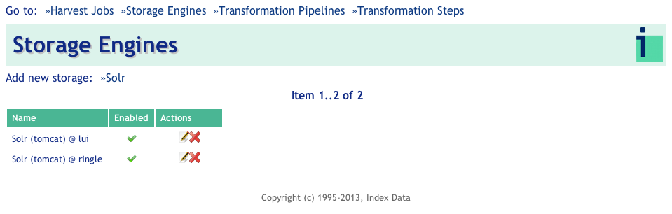

The Harvester currently supports the open source SOLR index only.

### Adding new Storage Engine ###

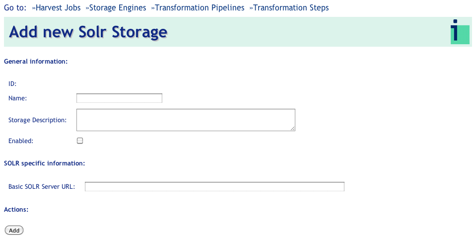

The following settings are used to set up a new SOLR storage:

* _Name_: Uniquely identifiable name, for example, "Solr (tomcat) @ donut".

* _Storage Description_: Optional description, such as "Solr running in tomcat on donut".

* _Enabled_: The Storage element will only be available for new Harvester jobs when enabled.

* _Basic SOLR Server URL_: The web service end point, e.g., _http://<some-server>/solr/<optional core>_


## Transformation Pipelines ##

The Harvester supports configurable transformation pipelines to normalize the harvested data. After selecting the _Transformation Pipelines_  menu, transformations will be listed as shown in the screen capture below:

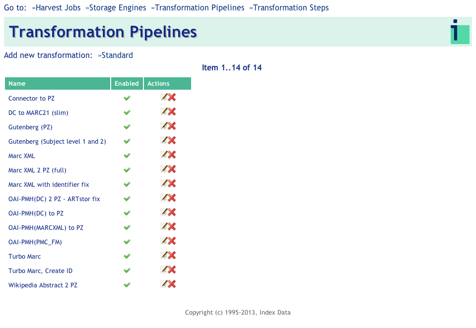

From here, transformations can be added, edited and deleted.

### Adding new Transformation Pipeline ###

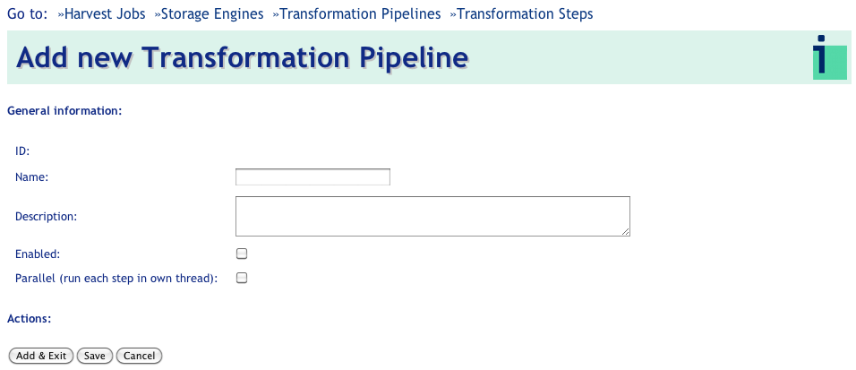

A Transformation Pipeline consists of some descriptive information, plus an ordered list of transformation steps that will be performed on the harvested data: 

* _Name_: Uniquely identifiable name that describes the transformation, e.g. "OAI-PMH(DC) to PZ (medium book)"

* _Description_: Optional description of the details of the transformation, such as "Converting from OAI-PMH(DC) to PZ".

* _Enabled_: Check to enable the transformation pipeline.

After clicking _Save_ (first time), it will be possible to insert transformation steps into the pipeline: 

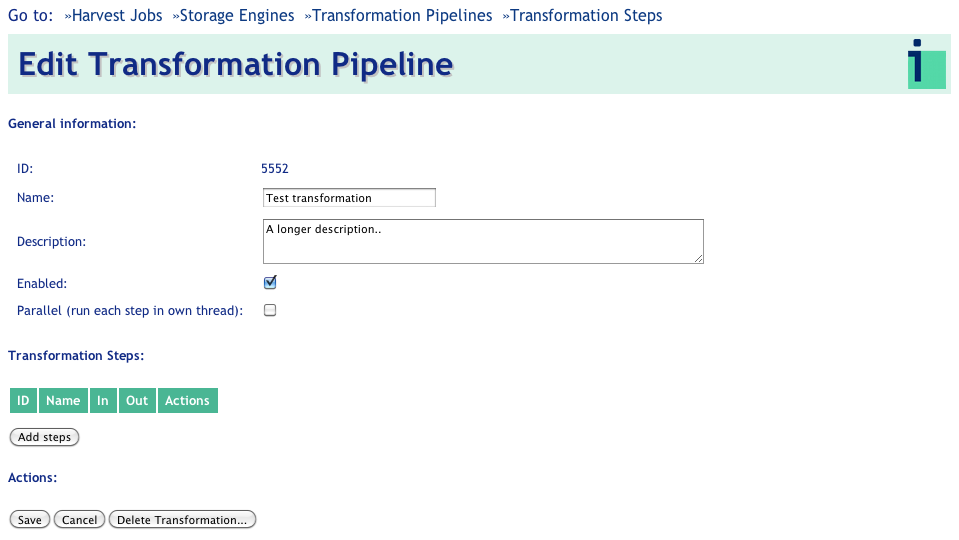

Pressing _Add steps_ displays a selection of available transformation steps. Multiple steps can be added to the chain of transformations by clicking on the __+__ icon next to the step name. 

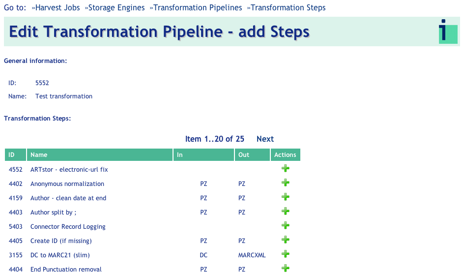

Closing the selection list will return to Transformation Pipeline edit screen; more steps can be added or re-ordered at a later time. After adding some steps, the Transformation pipeline could look like: 


which now shows a list of Steps, any of which can be re-ordered or removed. 

## Transformation Steps ##

To display a complete list of available transformation steps click the _Transformation Step_ menu item. Here, steps can be added, edited and deleted. Note, however, if a step is actually used in an existing transformation pipeline, the step cannot be deleted. 

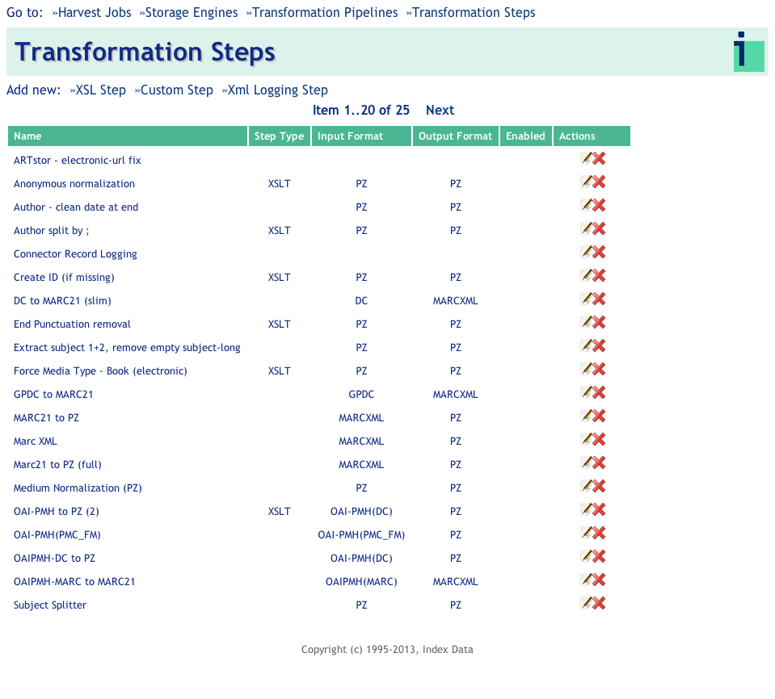

The only supported step type at the moment is an XSL transformation. Other step types, such as schema validate, are planned, but are currently not in production.


### Add a new XSL Step ###

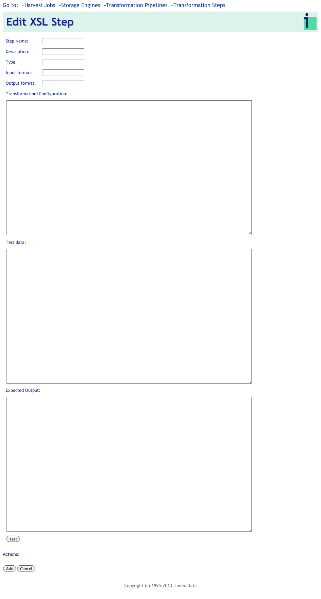

An XSL step consists of the following:

* _Step Name_: A unique, descriptive name 

* _Description_: Description of what the step does.

<!--
* _Type_: For future use. 
    D.: Yet some say "XSLT" in type. Is there any advantage to using this as a free-text field? 
    Jakub: Dennis, what is the purpose of this field?
    DS: Actually not sure what my plan was with this
    Jakub: disabled in the UI and in the manual
-->

* _Input Format/Output Format_: In a future release, these fields will be used for automated filtering and validation. Currently, these fields are used for visual step validation when viewed as a list. As shown in the illustration below, steps viewed in a series must display the output type in a previous step corresponding to the input format in a succeeding step, otherwise the transformation will fail.  

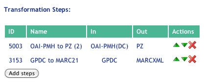

The Output Format of the first Step is PZ but the second step expects MARCXML as Input. This succession of steps will not produce the expected outcome.

* _Transformation/Configuration_: A valid XSL transformation script. Note that XSLT up to version 2 is supported. When the transformation is provided, you can  click the *Check* button to validate and compile the transform, any errors will be displayed in red.

* _Test_: If you provide some test data in this input area and then click
the *Run* button, you can see the result (or an error message in red) of the 
transformation.

* _Output_: Output of the rest run.
    
### Add a new Custom Step ###

Allows to specify a custom Java class for transforming records. This requires
that the fully qualified Java class names is specified and that the class
is available on the harvester classpath.

### Add a new XML Logging Step ###

A special instance of a Custom Step that allows dumping incoming records to the
job logfile.

# Searching the indexed resources #

The harvested, indexed resources are automatically searchable in the Index Data MasterKey
installation linked to the particular Harvester installation.

For Index Data hosted Harvester installation, log-in to http://mk2.indexdata.com with appropriate credentials to search.
