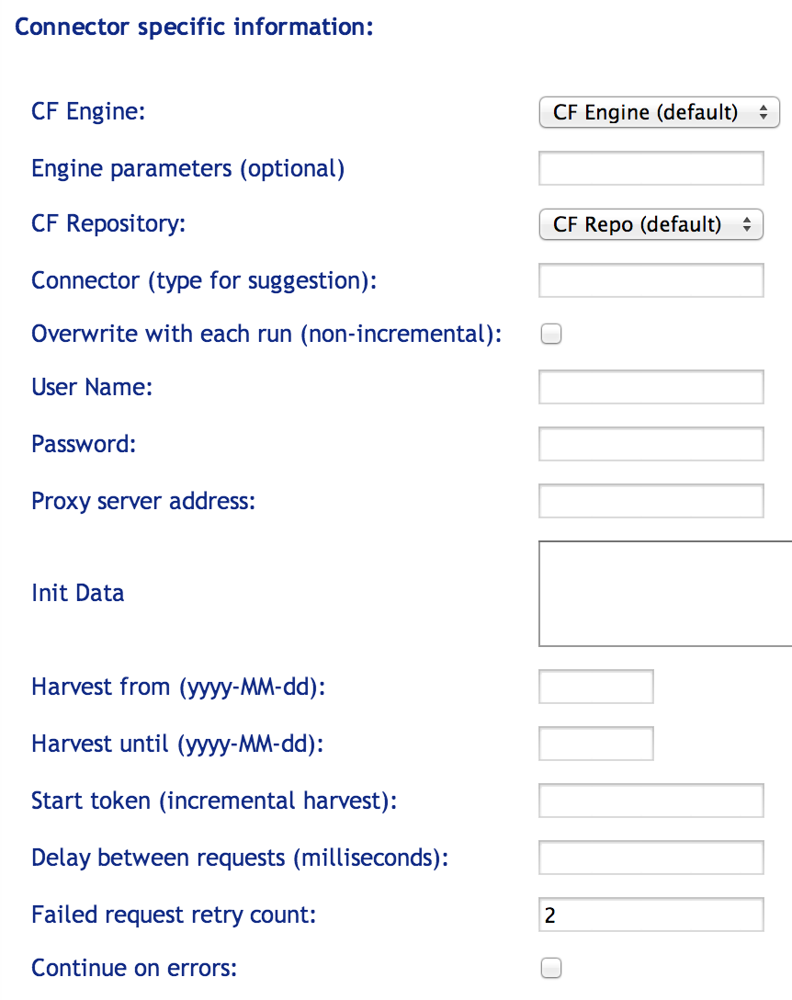
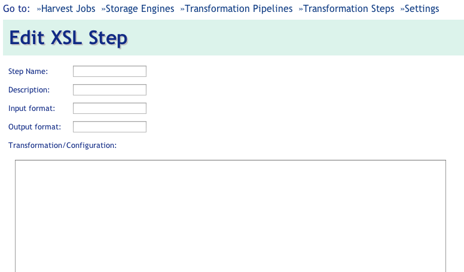

\newpage

# Using Harvester Admin #

## Harvest Jobs ##

The Harvester Admin web site (URL and login credentials are deployment specific) opens to the Harvest
Jobs page.

The navigation menu at the top of the Harvest Jobs page allows one to switch between sections of the Harvester Admin, such as "Storage Engines" or "Transformation Steps". 

The Harvest Jobs page displays a list of currently harvested resources along with corresponding job status. Using the icons in the "Actions" column, one can Edit (the job settings), Run the job (a play/stop toggle icon), View the most recent job log, or Delete the job.


By default, the job list view is refreshed automatically to enable monitoring job status without having to refresh the page. Turn off this behavior by unchecking the _Auto-Update_ check-box in the top-right corner.

Links for adding new harvest jobs appear just below the navigation menu.

### Editing or adding new Harvest Jobs ###

The Harvester currently supports harvesting OAI-PMH resources, XML/MARC binary bulk data, and data obtained through Index Data screen-scraping Connectors. 

Click one of those three selections to add a new Resource to harvest, and follow the instructions below. 

#### General Job Settings \

Setting up a new Harvesting job consists of enteringgeneral harvesting information as well as settings specific to the type of job (OAI-PMH, XML/Marc Bulk or Connector-based). 

The screen capture below shows the general settings applicable to all three types of Harvesting jobs:


* _Name_: Preferably a unique name for users to identify this Harvester resource.

* _Service Provider_,  _Content Description_,  _Technical Notes_ and _Contact Notes_: These free-text fields are not used by the Harvester, but by support staff for recording useful administrative information.

* _Harvest schedule_: Use these fields To define a recurring time/interval at which the Harvester job should run. 

<!-- 
    D: CAN WE REALLY ONLY SCHEDULE MONTHLY OR DAILY HARVESTS? THESE FIELDS CERTAINLY SUGGEST THAT, BUT I CAN SEE CUSTOMERS WANTING WEEKLY, BIWEEKLY, BIMONTHLY, ETC.
    Jakub: internally we can support any schedule that Cron supports:
    * weekly -- select any day of the week, eg Monday
    the others you mention cannot be directly represented with  drop-downs:
    (bimonthly could be hacked by choosing 31st, close)
    What we could do is to let users specify multiple schedules, which
    the harvester will evaluate in order:
    e.g:
    * biweekly ~ 2 times a month, e.g on the 14th and 28th of any month
    * bimonthly ~ list the exact month numbers: 1,3,5,7,9,11
    This is new development though.
-->

Check-boxes for:

* _Harvest now_: Check to run the harvesting job immediately upon clicking Add/Save.

* _Harvest job enabled_: Check to run the Harvesting job as described by the time/interval selected in "Harvest schedule". 

* _Overwrite_: Check to delete all previously harvested data before beginning the next scheduled (or manually triggered) run. Since OAI-PMH supports incremental updates, "overwrite" is not generally used with such jobs. If this feature is used with OAI-PMH processes, it is necessary to clear the "Harvest From" and "Resumption Token" fields, otherwise OAI-PMH jobs with "overwrite" selected will produce only a partial data set.

Drop-downs for:

* _Transformation Pipeline_: Select the transformation required to match the input format delivered by the feed to the internal format used by the Harvester for data storage. 
<!---
    D: THIS SECTION NEEDS MORE INFORMATION ON THE TRANSFORMATION CHOICES THEMSELVES.
    Jakub: maybe a link to the transformation section?
    D: I don't see that helping much, unless I'm missing something.
    Jakub: I mean there's a whole chapter on TPs in the manual, instead of putting more text here let's refer user to that section.
-->

* _Storage_: Select the storage type and location for the harvested data. The Harvester has a storage abstraction layer to allow it to work with multiple potential record storage systems, but at present, only Solr/Lucene is supported.

* _Encoding override_: A feed can return invalid encoded responses, such as having an XML header with encoding set to UTF-8, but actual return ISO-8859-1 in the data. Setting this field to the actually encoding will force the reader to use the specified encoding. 
<!---
D. Encoding override needs explanation; it is missing in the manual right now. When would it be required? What values are allowed? What is the input format? Will this be a drop-down later?
    Jakub: Dennis, could you please fill out this section?
    DS: See above.  
-->

#### Resource-specific Settings \

Depending on which resource type you choose, the following settings will apply.

##### OAI-PMH Specific Information: \
 


* _OAI Repository URL_: Enter a link (http-based) to the resource to be harvested. Include the base link defined by OAI Set Name: (see below). Some resources have multiple sets within the repository. If no specific set is identified by the URL, the full repository will be harvested.

* _OAI Set Name_: an optional setting, an OAI-PMH _setSpec_ value which specifies set criteria for selective harvesting.

* _Metadata Prefix_: A string that specifies the metadata format in OAI-PMH requests issued to a targeted repository. It is important to choose the correct format or no data will be harvested from the repository. Make sure a Transformation Pipeline that matches the metadata format used in the repository is selected, otherwise records will not be understood by the Harvester. Repositories generally use one of the following prefixes (or embedded data formats): Dublin Core (OAI-DC) or MARC XML (MARC12/USMARC). Other less common MetadataPrefix values include PMC (PubMed Central full-text records), PMC (PubMed Central metadata records), and PZ2 (pazpar2).

* _Use long date format_: Check-box to indicate whether to use a long date format when requesting records from the OAI-PMH resource. This is not used very often, but is required by some resources.

* _Harvest from (yyyy-MM-dd)_: If empty and no resumption token is set, the Harvester will harvest the full data set from the resource. When this field contains a value, upon completion of the job the Harvester will reset the value of this field to the day prior to the current run date, so subsequent runs will harvest only new records.

* _Harvest until (yyyy-MM-dd)_: upper date limit for selective harvesting. On consecutive runs the Harvester will clear this field making the date interval open-ended.

* _Resumption token_: The OAI-PMH protocol supports splitting bigger datasets into smaller chunks. On delivery of a chunk of records, the OAI-PMH returns a token which the next request should use in order to get the next chunk. If an OAI-PMH job halts before completion, the resumption token will be set in this field. Sometimes it is possible to run it again from this resumption point at a later stage, but this is not always supported.

* _Clear resumption token on errors_: clear the resumption token for harvests that complete in an error state. This is useful when server errors out and the last resumption token is no longer valid.

* _Keep partial harvests_: when checked, partial records harvested during a failed harvest run will be retained in storage.

##### XML/MARC Bulk Specific Information: \

The XML/MARC specific settings look like this:


* _URLs_: One or more space-separated URL for XML or MARC binary data. Jump or index pages (e.g. html pages with URLs) are supported as well.

* _Split at depth_: For XML data. This should usually be set to 1 for XML feeds, if we want to harvest the record elements in the data structured like:

```
    <root>
     <record/>
     <record/>
     …
    </root>
```

* _Split (number of records)_: The Harvester tries to imply streaming parsing where possible, but many XSL Transformations will not support this. Attempting to transform millions of records will be too memory consuming, so breaking the resource into chunks of 1000 records seems to be a reasonable option. Enter into this field the number of records to be contained in each chunk. 

* _MIME-type for compressed data_: The Harvester detects the type (XML vs MARC binary) from the MIME-type. A correctly configured web site will send a MIME-type of Application/marc if the file type is .mrc. If the MIME-type received is different than expected (because of a wrongly configured web site or wrong file type), the MIME-type might need to be overridden. The format of this field is:
```
    MIME-type [; optional character encoding]. 
```
The Harvester  supports gzipped data (and partly supports zipped data: only the first entry will be extracted), but the Harvester then needs to be configured for the format the compressed data contains (XML or MARC).

* _Output format_: This field expresses the output format of binary MARC reading--which will also be the input format for the transformation pipeline. If the Transformation Pipeline expects MARC21 XML, this should be set to Application/marc. If the pipeline expects Turbo MARC XML, it should be set to Application/tmarc.

* _Allow errors_: Check to continue harvesting and storing records even if retrieving some of the resources from the list fails

* _Use conditional HTTP request_: ask the server if the files are modified before attempting a harvest, relies on proper timestamp handling on the server side. It's usually safe to have this enabled as servers are eager to update the modification date, even in cases when the files themselves don't change.


##### Connector Specific Information: \

The Connector Harvest Job uses MasterKey Connect technology to harvest and extract information from any web site or data source that does not support standard harvesting protocols such as OAI-PMH. In order to set up Harvesting Connector jobs, one must have access to the _harvesting connector_ prepared for the MKC platform. Please see MKC pages on the IndexData website for more information. Specific settings look like this:



* _Connector Engine URL_: Enter here the URL pointing to the connector engine instance that will be used to execute the Connector harvesting job. The engine is either hosted by Index Data or installed locally on the customer site.

* _Connector (repo) URL_: Enter here the URL to the harvesting connector specific to the harvested resource. If the URL points to a connector in the _Connector Repository_, make sure to provide repository authentication credentials in the URL like so: `http(s)://<repouser>:<repopass>@url.to.the.repo/connector.name.cf`.

* _User Name_: User name required for access to a harvested resource that requires authentication.

* _Password_: Password required for access to a harvested resource that requires authentication.

<!---
    D.: Is there a way to authenticate using IP? That's amore common authentication method
    Jakub: there is a way to provide proxy IP in the init JSON, but there's no
    seperate input field in the UI. Dennis, should we add one? 
    DS: Could do. 
-->

* _Init Data_: Advanced setting to provide additional initialization parameters to the harvesting connector. Any username/password specified in the inputs above will take precedence over settings specified in this field. These settings must be provided in JSON format.

* _Harvest from_: Start date for selective harvesting; this functionality depends on the connector capability.

* _Harvest until_: End date for selective harvesting; this functionality depends on the connector capability.

* _Resumption token_: The use of a resumption token for incremental harvesting is connector specific and depends on the connector capability.

* _Delay between requests_: delay between requests made from the harvester to the connector engine. Use when the resource is sensitive to high loads.


## Storage Engines ##

Selecting the _Storage Engines_ menu item shows the list of currently configured storage formats and locations. From this screen one can add, edit or delete a storage specification for harvested records.


The Harvester currently supports the open source SOLR index only.

### Adding new Storage Engine ###


The following settings are used to set up a new SOLR storage:

* _Name_: Uniquely identifiable name, for example, "Solr (tomcat) @ donut".

* _Storage Description_: Optional description, such as "Solr running in tomcat on donut".

* _Enabled_: The Storage element will only be available for new Harvester jobs when enabled.

* _Basic SOLR Server URL_: The web service end point, e.g., _http://<some-server>/solr/<optional core>_


## Transformation Pipelines ##

The Harvester supports configurable transformation pipelines to normalize the harvested data. After selecting the _Transformation Pipelines_  menu, transformations will be listed as shown in the screen capture below:


From here, transformations can be added, edited and deleted.

### Adding new Transformation Pipeline ###


A Transformation Pipeline consists of some descriptive information, plus an ordered list of transformation steps that will be performed on the harvested data: 

* _Name_: Uniquely identifiable name that describes the transformation, e.g. "OAI-PMH(DC) to PZ (medium book)"

* _Description_: Optional description of the details of the transformation, such as "Converting from OAI-PMH(DC) to PZ".

* _Enabled_: Check to enable the transformation pipeline. 

<!--
    D.: I think we need some controls on this, since I just saved ID 5953 without putting any data into it. For a later version, perhaps require at least a name, so it shows up on the list
    Jakub: good point, we need more field validation all over the place. I will
    file a bug on it.
-->

After clicking _Save_ (first time), it will be possible to insert transformation steps into the pipeline: 


Pressing _Add steps_ displays a selection of available transformation steps. Multiple steps can be added to the chain of transformations by clicking on the __+__ icon next to the step name. 


Closing the selection list will return to Transformation Pipeline edit screen; more steps can be added or re-ordered at a later time. After adding some steps, the Transformation pipeline could look like: 


which now shows a list of Steps, any of which can be re-ordered or removed. 

## Transformation Steps ##

To display a complete list of available transformation steps click the _Transformation Step_ menu item. Here, steps can be added, edited and deleted. Note, however, if a step is actually used in an existing transformation pipeline, the step cannot be deleted. 


The only supported step type at the moment is an XSL transformation. Other step types, such as schema validate, are planned, but are currently not in production.


### Add a new XSL Step ###



An XSL step consists of the following:

* _Step Name_: A unique, descriptive name 

* _Description_: Description of what the step does.

<!--
* _Type_: For future use. 
    D.: Yet some say "XSLT" in type. Is there any advantage to using this as a free-text field? 
    Jakub: Dennis, what is the purpose of this field?
    DS: Actually not sure what my plan was with this
    Jakub: disabled in the UI and in the manual
-->

* _Input Format/Output Format_: In a future release, these fields will be used for automated filtering and validation. Currently, these fields are used for visual step validation when viewed as a list. As shown in the illustration below, steps viewed in a series must display the output type in a previous step corresponding to the input format in a succeeding step, otherwise the transformation will fail.  


The Output Format of the first Step is PZ but the second step expects MARCXML as Input. This succession of steps will not produce the expected outcome.

* _Transformation (XSL)_: A valid XSL transformation script. Note that XSLT up to version 2 is supported. 

<!---
  Jakub: testing is disabled in the manual and the UI until it works
* _Test data_: For future use. 

* _Expected output_: For future use.
    
    D.: Since these huge fields are only for future use, we should make them smaller--at least in this image, and probably in the UI as well.
    Also--if the "Test" button doesn't do anything, remove it? If it does anything, let's describe it please. 
    Jakub: I agree, if those fields serve no purpose at the moment let's hide
    them entirely from the UI and remove entries from the manual.
    DS: We did talk about implementing this test feature, but sure until it's done
-->

### Add a new Custom Step ###

### Add a new XML Logging Step ###
<!--
    D.: Don't these two options need to be described? They're mostly similar to adding an XSL step, but also include at least one unique field.
    Jakub: agree
-->

# Searching the indexed resources #

The harvested, indexed resources are automatically searchable in the Index Data MasterKey
installation linked to the particular Harvester installation.

For Index Data hosted Harvester installation, log-in to http://mk2.indexdata.com with appropriate credentials to search.
