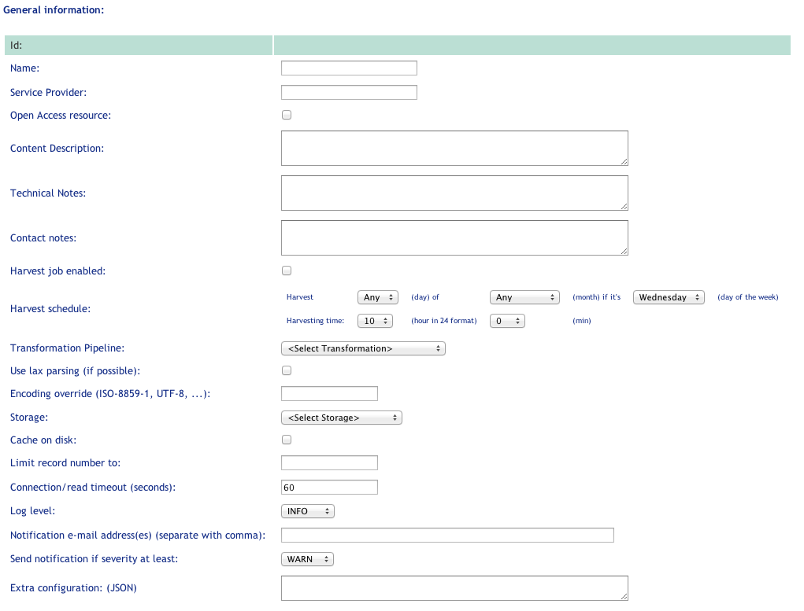
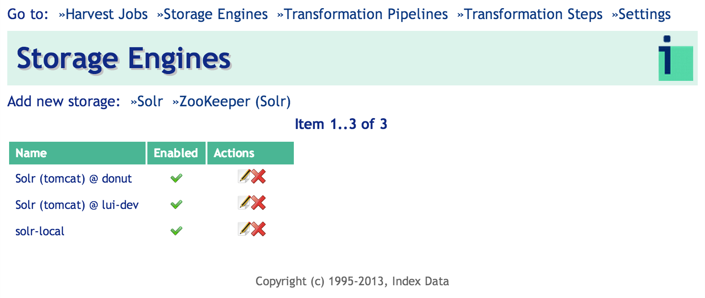
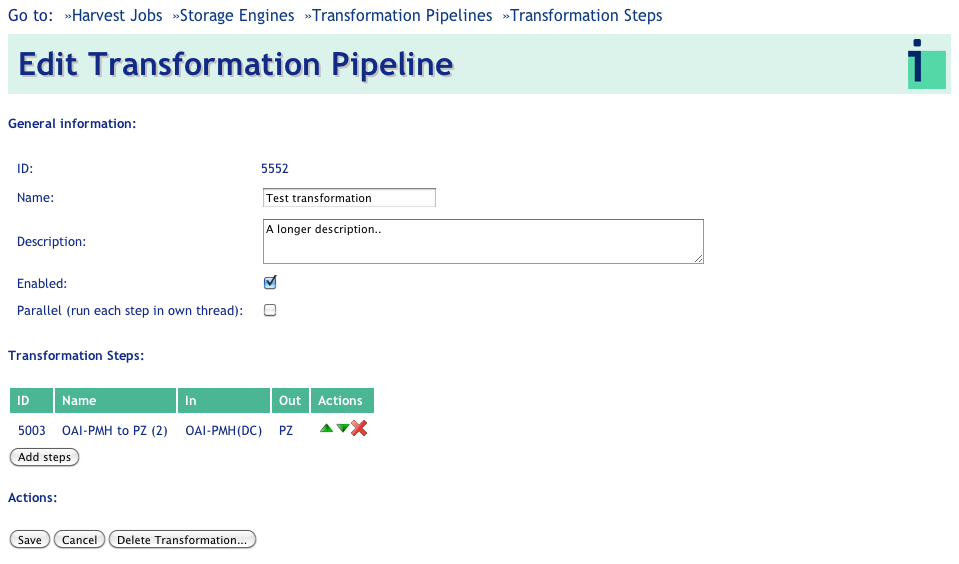

\newpage

# Using Harvester Admin #

## Harvest Jobs ##

The Harvester Admin web site (URL and login credentials are deployment specific) opens to the Harvest
Jobs page.

The navigation menu at the top of the Harvest Jobs page allows one to switch between sections of the Harvester Admin, such as "Storage Engines" or "Transformation Steps". 

The Harvest Jobs page displays a list of currently harvested resources along with corresponding job status. Using the icons in the "Actions" column, one can Edit (the job settings), Run the job (a play/stop toggle icon), View the most recent job log, or Delete the job.


By default, the job list view is refreshed automatically to enable monitoring job status without having to refresh the page. Turn off this behavior by unchecking the _Auto-Update_ check-box in the top-right corner.

Links for adding new harvest jobs appear just below the navigation menu.

### Editing or adding new Harvest Jobs ###

The Harvester currently supports harvesting OAI-PMH resources, XML/MARC binary bulk data, and data obtained through Index Data screen-scraping Connectors. 

Click one of those three selections to add a new Resource to harvest, and follow the instructions below. 

#### General Job Settings \

Setting up a new Harvesting job consists of enteringgeneral harvesting information as well as settings specific to the type of job (OAI-PMH, XML/Marc Bulk or Connector-based). 

The screen capture below shows the general settings applicable to all three types of Harvesting jobs:



* _Name_: Preferably a unique name for users to identify this Harvester resource.

* _Service Provider_,  _Content Description_,  _Technical Notes_ and _Contact Notes_: These fields are not used by the Harvester, but by support staff for recording useful administrative information.

* _Harvest schedule_: Use these fields To define a recurring time/interval at which the Harvester job should run. [QUESTION: CAN WE REALLY ONLY SCHEDULE MONTHLY OR DAILY HARVESTS? THESE FIELDS CERTAINLY SUGGEST THAT, BUT I CAN SEE CUSTOMERS WANTING WEEKLY, BIWEEKLY, BIMONTHLY, ETC. ANSWER (DS): The module follows the crontab model: minute, hourly, daily, weekly, monthly, and also multiple times per unit, but the UI does not support the later (multiple times)]

Check-boxes for:

* _Harvest now_: Check to run the harvesting job immediately upon clicking Add/Save.

* _Harvest job enabled_: Check to run the Harvesting job as described by the time/interval selected in "Harvest schedule". 

* _Overwrite_: Check to delete all previously harvested data before beginning the next scheduled (or manually triggered) run. Since OAI-PMH supports incremental updates, "overwrite" is not generally used with such jobs. If this feature is used with OAI-PMH processes, it is necessary to clear the "Harvest From" and "Resumption Token" fields, otherwise OAI-PMH jobs with "overwrite" selected will produce only a partial data set.

Drop-downs for:

* _Transformation Pipeline_: Select the transformation required to match the input format delivered by the feed to an internal format used by the Harvester for data storage. [THIS SECTION NEEDS MORE INFORMATION ON THE TRANSFORMATION CHOICES THEMSELVES.]

* _Storage_: Select the storage type and location for the harvested data. The Harvester supports multiple backend storages. This could be for staging like Development, Testing and Production, or it could be for different customers.

#### Resource-specific Settings \

Depending on which resource type you choose, the following settings will apply.

##### OAI-PMH Specific Information: \


* _OAI Repository URL_: a link (http-based) to the resource to harvest. The base link defined by OAI Set Name: some resources have multiple sets within the repository. If none is selected, the full repository will be harvested.

* _Metadata Prefix_: A repository uses one of two prefixes (or data embedding format): Dublin Core or MARC XML embedded data. It is important to choose the right one otherwise no data will be harvested. Also, the Transformation selected should match this format otherwise no record will be found. 

* _Use long data format_: Check-box to indicate whether to use a long data format when asking for records from the OAI-PMH resource. This is not used very often, but should match what the resource requires.

* _Harvest from date_: If empty and no resumption token is set, the Harvester will harvest the full data set from the resource. On completion the Harvester will set the date to yesterday, so next run will only harvest the newer records received since last run.

* _Resumption token_: The OAI-PMH protocol supports splitting bigger datasets into smaller chunks. On delivery of a chunk the OAI-PMH returns a token which the next request should use in order to get the next chunk. If an OAI-PMH job halts before completion the resumption token will be set in this field. Sometimes it is possible to run it again from this resumption point at a later stage, but this is not always supported.

* _Clear resumption token on errors_: clear the resumption token for harvests that complete in an error state. This is useful when server errors out and the last resumption token is no longer valid.

* _Keep partial harvests_: when checked, partial records harvested during a failed harvest run will be persisted in the storage rather than ignored.

##### XML/MARC Bulk Specific Information: \

The XML/MARC specific settings look like this:


* _URLs_: One or more space-separated URL to XML or MARC binary data. Jump or index pages (e.g. html pages with URLs) are supported as well.

* _Split at depth_: For XML data. This should usually be set to 1 for XML feeds, if we want to harvest the record elements in the data structured like:

```
    <root>
     <record/>
     <record/>
     …
    </root>
```

* _Split (number of records)_: The Harvester tries to imply streaming parsing where possible, but some (rather most) XSL Transformations will not support this. Attempting to transform millions of records will be too memory consuming. Breaking into chunks of 1000 seems to be a reasonable option.

* _MIME-type for compressed data_: The Harvester detects the type (XML vs MARC binary) from the MIME-type. A correctly configured web site will send a MIME-type of Application/marc if the file type is .mrc. If the MIME-type received is different than expected (because of a wrongly configured web site or wrong file type), the MIME-type might need to be overridden. The format of the field is:
```
    MIME-type [; optional character encoding]. 
```
The Harvester  supports gzipped data (and partly supports zipped data: only the first entry will be extracted), but the Harvester then needs to be configured of the format the compressed data contains (XML or MARC).

* _Output format_: This express the output format of binary MARC reading which will be the input for the transformation pipeline. If the Transformation Pipeline expects MARC21 XML, this should be set to Application/marc. If the pipeline expects Turbo MARC XML, it should be set to Application/tmarc.

* _Allow errors_: continue harvesting and storing records even if retrieving some of the resources from the list fails

* _Use conditional HTTP request_: ask the server if the files where updates before attempting a harvest, relies on proper timestamp handling on the server side.

##### Connector Specific Information: \

The Connector Harvest Job uses a MasterKey Connect technology to harvest and extract information from any web site and data source that does not support standard harvesting protocols like OAI-PMH. In order to use it, you must have access
to the _harvesting connector_ prepared for the MKC platform. Please see MKC pages on IndexData website for more information. Specific settings look like this:


* _Connector Engine URL_: URL that points to the connector engine instance that
will be used to execute the Connector harvesting job. The engine is either hosted by Index Data or installed on the customer site.

* _Connector (repo) URL_: URL to the harvesting connector specific to the harvested resource. If the URL points to a connector in the _Connector Repository_, make sure to provide repository authentication credentials in the URL like so: `http(s)://<repouser>:<repopass>@url.to.the.repo/connector.name.cf`.

* _User Name_: User name to access the harvested resource (e.g website).

* _Password_: Password to access the harvested resource (e.g website).

* _Init Data_: Advanced setting to provide additional init parameters to the harvesting connector. Any username/password specified in the inputs above will take precedence over settings in the specified in this field. The settings must be provided in JSON format.


* _Harvest from_: Start date for selective harvesting, this functionality depends on the connector capability.

* _Harvest until_: End date for selective harvesting, this functionality depends on the connector capability.

* _Resumption token_: connector specific and depends on the connector capability.

* _Delay between requests_: delay between requests made from the harvester to the connector engine. Use when the resource is sensible to high loads.


## Storage Engines ##

Selecting the _Storage Engines_ menu item shows the list of currently configured storages. From this screen you can add, edit or delete a Storage for harvested records.



The Harvester currently supports the open source SOLR index only.

### Adding new Storage Engine ###


The following settings are used to set up a new SOLR storage:

* _Name_: Uniquely identifiable name for users.

* _Storage Description_: Optional description of the storage for support. 

* _Enabled_: The Storage will only be available for new Harvester jobs when enabled.

* _Basic SOLR Server URL_: The web service end point, e.g., _http://<some-server>/solr/<optional core>_


## Transformation Pipelines ##

The Harvester supports configurable transformation pipelines to normalize the harvested data. After selecting the _Transformation Pipelines_  menu, transformations will be listed as shown in the screen capture below:


From here, transformations can be added, edited and deleted.

### Adding new Transformation Pipeline ###


A Transformation Pipeline consists of some descriptive information, plus an ordered list of transformation steps that will be executed over the harvested data: 

* _Name_: Uniquely identifiable name that describes the transformation.
Description 

* _Enabled_: Enabling/disabling the transformation pipeline. 

After clicking _Save_ (first time), it will be possible to insert transformation steps into the pipeline: 


Pressing the _Add steps_ will bring up a selection of available transformation steps. Multiple steps can be added by clicking on the __+__ icon next to the step name. 


Closing the selection list will return to Transformation Pipeline edit screen, more steps can be added or re-order at later time. After adding some steps, the Transformation pipeline could look like: 



which now shows a list of Steps, that can be re-ordered or removed. 

## Transformation Steps ##

The only supported Step type at the moment is an XSL transformation. Other step types like schema validate are planned, but currently not in production. A list of transformation steps in the Harvester Admin us be shown by clicking the _Transformation Step_ menu item. On the _Transformation Step_ page steps can be added, edited and deleted. Note, however, if a step is used in a transformation pipeline, the deletion will not happen.


### Adding new XSL Step ###


A step consists of:

* _Step Name_: A unique and descriptive name 

* _Description_: Description of what the step does.

* _Type_: For future use. 

* _Input Format/Output Format_: Currently only used for manual user validation; the output type in the previous step should be the same as the input format here. To be used for automated filtering and validation in a future release.

The following picture shows how the Input/Output Formats can be used to detect wrongly configured transformation steps:


The Output Format of the first Step is PZ but the second step expects MARCXML as Input Format. This will not produce the expected outcome (if any).

Transformation (XSL): A valid XSL transformation script. XSLT up to version 2 is supported. 

* _Test data_: For future use. 
* _Expected output_: For future use.

# Searching the indexed resources #

The indexed resources are automatically searchable in the Index Data MasterKey
installation linked to the particular Harvester installation.

For Index Data hosted Harvester installation, log-in to http://mk2.indexdata.com with appropriate credentials to search.
